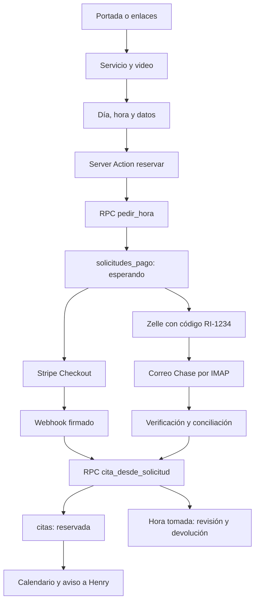

# Análisis de La ruta del inmigrante

Revisión del código local realizada el 5 de septiembre de 2026. Referencia inicial: commit `99e2e6c`.

> Este documento registra el diagnóstico previo al rediseño. Posteriormente se implementaron las páginas Inicio, Henry, Asesoría y Reserva, se unificó la oferta pública a $70, se corrigió la zona horaria inicial y se eliminó la falsa confirmación al entrar a `/gracias`. Se añadieron dos imágenes editoriales, revisión visual móvil/escritorio y siete pruebas del cobro (87 en total). Los hallazgos sobre SQL y conciliación no forman parte de este rediseño.

El proyecto tiene una arquitectura pequeña y comprensible, con bastante lógica de negocio en PostgreSQL. Compila y sus pruebas pasan, pero conviven tres generaciones del flujo de reserva: reserva inmediata, retención temporal y solicitud sin bloqueo hasta recibir el pago. Esa transición explica varias discrepancias entre interfaz, documentación y permisos SQL.

## Alcance y comprobaciones

Se revisaron las rutas públicas y administrativas, componentes, lógica de horarios, clientes de Supabase, cobros, conciliación de correo, las 14 migraciones, la Edge Function, configuración, recursos públicos, pruebas y script de diagnóstico IMAP.

| Comprobación local | Resultado |
| --- | --- |
| `npm test` | 80 pruebas correctas, distribuidas en 4 archivos |
| `npm run typecheck` | Correcto |
| `npm run build` | Compilación de producción correcta con Next.js 16.3.1 |
| Ejemplo sintético de conciliación Zelle | Confirma por importe único incluso con nombre y código de memo diferentes |
| Ejemplos de zona del visitante | Lima, Bogotá y Madrid terminan usando `America/Denver` con la selección inicial actual |

Los ejemplos sintéticos se ejecutaron en memoria con las funciones del repositorio, sin modificar sus archivos ni conectarse al banco.

No se verificaron el esquema desplegado, las credenciales, el estado de los crons, pagos reales, correos reales ni avisos en teléfonos. Tampoco se realizó una prueba visual en navegador ni una auditoría del contenido jurídico. Las observaciones SQL describen el resultado esperado de aplicar las migraciones del repositorio; producción podría tener ajustes manuales distintos. La Edge Function está excluida del `typecheck` de Next.js.

## Producto y audiencia

La web vende sesiones individuales de 45 minutos con Henry Orellana para preparar audiencias. El catálogo vive en `lib/servicios.ts`:

| Identificador | Servicio | Precio configurado |
| --- | --- | --- |
| `primera` | Primera audiencia, preliminar | USD 70 |
| `segunda` | Segunda audiencia, preliminar | USD 150 |
| `tercera` | Tercera audiencia, mérito | USD 250 |

Los tres servicios comparten una agenda. La interfaz está en español, prioriza el teléfono y usa una pregunta por paso. La página declara que Henry no es abogado. La base recoge nombre, correo, WhatsApp, nacionalidad y ubicación; no encontré un campo de estatus migratorio.

El repositorio se presenta como independiente de ANDEX. Los otros negocios se enlazan desde `/links`; no hay integración de sus bases de datos en este código. El buzón bancario, en cambio, sí se describe como compartido con otro negocio.

## Arquitectura y responsabilidades

| Capa | Implementación y función |
| --- | --- |
| Aplicación | Next.js 16.3.1, App Router, React 19, TypeScript estricto |
| Presentación | Tailwind CSS 4, CSS propio, Source Sans 3 y Source Serif 4 |
| Lecturas | Server Components consultan Supabase y entregan datos serializados a componentes interactivos |
| Escrituras | Server Actions en `app/reservar` y `app/panel`, más funciones RPC de PostgreSQL |
| Base y acceso | Supabase/PostgreSQL, Auth, permisos por rol y RLS |
| Tarjeta | Stripe Checkout alojado y webhook firmado |
| Zelle | IMAP con ImapFlow, Mailparser, parser de alertas Chase y reglas propias de conciliación |
| Avisos | Trigger con `pg_net`, Edge Function Deno y Web Push |
| Operación | Configuración de despliegue y crons en Vercel |
| Pruebas | Vitest; horario y partes de la lógica de conciliación |

`proxy.ts` refresca la sesión al visitar `/panel`. La autorización se vuelve a comprobar en el layout mediante `getUser()` y `es_admin()`, y la base protege las operaciones mediante RLS. La aplicación Next.js utiliza la clave pública; la Edge Function usa la clave de servicio que recibe de su entorno Supabase.

No hay ORM, servidor independiente ni proveedor de IA. El componente llamado `AgenteChat` es una guía determinista con respuestas preescritas y botones; no acepta texto libre ni llama a un modelo.

## Mapa de pantallas y endpoints

| Ruta | Función actual |
| --- | --- |
| `/` | Portada con relato, explicación de servicios, precios y acceso a reservar |
| `/links` | Enlaces a preparación, USALatino Prime, ANDEX y bootcamp; guía animada y preguntas frecuentes |
| `/reservar` | Selección de servicio cuando falta; después video, día, hora, datos y pago |
| `/gracias` | Mensaje de confirmación y datos recuperados de `sessionStorage` |
| `/panel/entrar` | Inicio de sesión con correo y contraseña |
| `/panel` | Calendario semanal, vista diaria móvil, cierres y eventos; ajustes de horario plegables |
| `/panel/horario` | Redirección a `/panel` |
| `/panel/personas` | Consulta, filtros y CSV de hasta 500 citas |
| `/panel/pagos` | Pagos Zelle sin asignar, solicitudes esperando y casos que requieren devolución |
| `/panel/salir` | Cierre de sesión por POST |
| `/api/stripe` | Webhook de Stripe |
| `/api/zelle` | Conciliador protegido por `CRON_SECRET` |
| `/api/zelle/latido` | Comprueba antigüedad del último barrido exitoso |
| `/api/diagnostico` | Diagnóstico de variables y conexión a Stripe, protegido con un secreto en la URL |

## Flujo real de reserva y pago

El formulario consulta una ventana de 60 días. El horario semanal admite varios tramos por día; las sesiones empiezan en punto. `America/Denver` es la zona de referencia y las funciones usan `Intl` para manejar cambios de horario estacional.

`pedir_hora()` guarda una solicitud con código de cuatro dígitos, vencimiento nominal de dos horas y estado `esperando`. No ocupa la agenda: varias personas pueden solicitar la misma hora. El pago confirmado intenta crear la cita. Si ya existe otra cita, se registra `hora_tomada` para intervención manual.

Con Stripe, el navegador abre Checkout y el servidor recibe el evento firmado. Con Zelle, el cron lee hasta 50 mensajes por barrido, comprueba cabeceras de autenticación, extrae importe y transacción, obtiene solicitudes candidatas y aplica una decisión. Usa un cursor IMAP, una marca propia y un cerrojo temporal. La transacción bancaria sirve para detectar duplicados.

`vercel.json` programa el barrido cada dos minutos en los minutos impares y el latido en el minuto 17 de cada hora. El latido devuelve error cuando nunca hubo éxito o han pasado más de seis horas; el código de esa ruta no envía una notificación por sí mismo.

## Modelo de datos y evolución

| Tabla | Responsabilidad |
| --- | --- |
| `administradores` | Lista de usuarios autorizados para gestionar |
| `citas` | Citas, estados y datos de cobro; índice único por hora para citas no canceladas |
| `horario` | Tramos semanales de apertura |
| `cierres` | Ausencias o bloqueos por intervalo |
| `eventos` | Actividades personales, con indicador de si ocupan la hora |
| `solicitudes_pago` | Datos previos al cobro y seguimiento de su conversión en cita |
| `zelle_correos` | Registro de transacciones, autenticidad y decisiones |
| `zelle_cursor` | Progreso del buzón, último resultado y cerrojo temporal |
| `suscripciones_push` | Dispositivos suscritos a avisos |
| `privado.secretos` | Secreto utilizado por las RPC del cobro y conciliador |

Las migraciones `0001–0007` construyen agenda, horario, contacto, avisos y servicios. `0008` introduce citas pendientes con retención de 30 minutos. `0009–0010` añaden funciones para conciliación y trasladan el secreto a una tabla privada. `0011` cambia el modelo a solicitudes sin bloqueo. `0012` añade exclusión temporal y latido; `0013`, conciliación manual; `0014`, eventos personales.

Es necesario leer las redefiniciones sucesivas: una función en una migración antigua no siempre representa su comportamiento final.

## Fortalezas verificadas en el código

- El índice único en PostgreSQL impide guardar dos citas activas para el mismo instante.
- Las tablas con datos personales están protegidas con RLS; la disponibilidad pública devuelve instantes, sin nombres ni correos.
- Horarios separados de la lectura de base, con pruebas de rangos, tramos y cambios de hora.
- Stripe comprueba la firma del webhook y el estado `paid`; el botón exige las tres variables necesarias para cobrar y confirmar.
- Zelle incluye controles de autenticidad, detección de plantillas desconocidas, registro de decisiones y revisión manual.
- El CSV escapa comillas y neutraliza prefijos de fórmulas. La búsqueda de personas permanece en el navegador.
- El service worker no almacena páginas del panel en una caché offline.
- La interfaz incorpora etiquetas accesibles, navegación por teclado en la rejilla y reglas para reducir animaciones.

## Hallazgos prioritarios

### 1. El cobro de Stripe no está vinculado de forma suficiente a la solicitud

Prioridad alta. `app/reservar/pagar.ts:15` recibe del cliente `solicitudId`, `servicioId` y correo. Calcula un precio válido para ese servicio, pero no lee la solicitud para comprobar que sea su servicio. `app/api/stripe/route.ts:84` confirma por el identificador sin comparar importe, moneda ni servicio contra lo guardado.

Consecuencia derivada del código: una solicitud de USD 250 puede asociarse a un Checkout de USD 70 y terminar confirmada. El identificador también es un número sin prueba de posesión de la solicitud. Conviene resolver el servicio y el precio desde la solicitud en el servidor, proteger el acceso con un token opaco y validar importe/moneda al confirmar. No se ejecutó un cobro para comprobarlo.

### 2. Zelle puede asignar dinero del otro negocio

Prioridad alta, reproducida con datos sintéticos. `lib/zelle/dominio.ts:554` confirma si hay una sola candidata por importe, antes de revisar el memo o el nombre. Un pago de otro remitente con `RI-9999` confirmó una candidata cuyo código era `1234`.

La pantalla de pagos declara que el buzón se comparte con USALatino Prime. La unicidad del importe entre solicitudes de esta web no prueba que el dinero pertenezca a esta web. Esta regla también está respaldada por pruebas existentes: requiere revisar la decisión de negocio, no solamente arreglar una excepción.

### 3. La migración al pago previo dejó entradas públicas antiguas

Prioridad alta, según el conjunto de migraciones. `0008_pago_previo.sql:451` conserva permiso público para `apartar_cita()`, además de los permisos de inserción por columna de `citas`. Ninguna migración posterior los retira.

Esas entradas permiten crear citas pendientes que ocupan horas sin seguir el flujo nuevo. La disponibilidad actual no llama al liberador de pendientes. Además, la nueva RPC pública `pedir_hora()` acepta `p_precio_usd` del llamante y no verifica su correspondencia con el catálogo. El precio calculado en la Server Action no protege una llamada directa a Supabase.

### 4. Los eventos personales no se validan al reservar

Prioridad alta. `0014_eventos_personales.sql` modifica `horas_ocupadas()` para ocultar esos huecos, pero no añade la comprobación de `eventos` a `pedir_hora()` ni a `privado.validar_cita()`.

Una pantalla cargada antes de crear el evento o una llamada directa puede reservar ese intervalo. La restricción debe existir también al crear la solicitud y al confirmar la cita.

### 5. La pantalla de gracias confirma sin comprobar

Prioridad alta. `app/gracias/page.tsx:49` afirma que la hora quedó apartada; `components/cita-confirmada.tsx:44` solo lee `sessionStorage`. No consulta pago ni cita. El botón «Ya lo mandé» llega a esta pantalla sin demostrar una transferencia. La vuelta desde Stripe tampoco acredita que el webhook haya terminado.

La portada, la guía y la hoja de servicios conservan mensajes de reserva inmediata y comprobación manual. Hace falta una pantalla con estados reales: esperando pago, confirmado y requiere atención.

### 6. Cambiar el horario puede ocultar citas vigentes

Prioridad alta. En `app/panel/(agenda)/page.tsx:160`, una celda fuera del horario actual se descarta antes de buscar la cita. La franja visible también se deriva exclusivamente del horario; los domingos se omiten cuando ya no tienen apertura.

Las citas no se borran de la base, pero pueden desaparecer del calendario después de reducir el horario. La vista debe incorporar también las horas y días de las citas existentes.

### 7. La hora local falla para visitantes fuera de EE. UU.

Prioridad alta para la audiencia prevista, reproducida con funciones locales. `components/formulario-reserva.tsx:140` cae en Utah cuando la zona del navegador no corresponde a un estado de la lista. Después utiliza la zona de ese estado en lugar de la del navegador.

Lima, Bogotá y Madrid terminan en `America/Denver`. Elegir «no estoy en EE. UU.» no corrige `zonaVisitante`. Debe conservarse la zona del navegador y permitir una selección explícita; la ubicación declarada y la zona horaria no son el mismo dato.

### 8. Los reintentos de conciliación pueden saltarse una aplicación fallida

Prioridad alta. El registro del correo y la aplicación del pago son RPC separadas. Si se registra la transacción y falla después, al reintentar `zelle_apuntar_y_candidatas()` devuelve `ya_visto`; `lib/zelle/conciliar.ts:165` termina sin volver a aplicar la decisión.

Además, solo se revisa `aplicado.error`: un resultado de negocio `{ok:false}` puede contarse como confirmado. Conviene distinguir registrado, aplicado y pendiente de reintento, y comprobar el resultado de negocio antes de incrementar contadores.

### 9. Los avisos no exigen ser administrador en todas sus capas

Prioridad alta si existen cuentas autenticadas ajenas al administrador. Las políticas de `suscripciones_push` comprueban propiedad de la fila, pero no `es_admin()`. La Edge Function lee todas las suscripciones y envía nombre y hora a todas.

Una cuenta no administradora podría suscribirse directamente a través de la API y recibir avisos, aunque no pueda abrir el panel. Debe exigirse autorización administrativa al suscribir y filtrar receptores al enviar. La existencia o apertura del registro de usuarios en producción no se verificó.

### 10. Configuración y manejo de errores necesitan cerrarse

Prioridad media, con varios efectos independientes:

- `0005_avisar.sql:39` contiene `TU-PROYECTO` y `SECRETO_DEL_AVISO`. Un despliegue limpio necesita configurar ese trigger; no hay una migración posterior que lo haga.
- `.env.example` todavía indica guardar el secreto mediante `alter database`, mientras las RPC finales lo leen de `privado.secretos`.
- `/api/diagnostico` recibe el secreto compartido en `?clave=`. Ese secreto permite operaciones privilegiadas y puede quedar en historiales o registros. Debe ir en una cabecera o sustituirse por autorización administrativa.
- `leerTramos()` devuelve el horario por defecto si falla la consulta; `diasDisponibles()` ignora el error de horas ocupadas. El resultado puede parecer una agenda disponible cuando la base no respondió.
- La caducidad de solicitudes se procesa al registrar un correo nuevo, no mediante un barrido independiente. Sin nuevos correos pueden persistir solicitudes `esperando` vencidas. Las caducadas quedan fuera del selector de conciliación manual.
- Si una hora pasa o se cierra después de iniciar el pago, el trigger puede rechazar la creación de la cita. Esos errores no se transforman todos en un caso visible de devolución como sí ocurre con `HORA_TOMADA`.

## Límites funcionales y de mantenimiento

- No están los tres MP4 esperados en `public/videos`; solo hay instrucciones. El paso permite continuar.
- No encontré envío de confirmaciones o recordatorios por correo, generación de enlace de videollamada ni sincronización con calendarios externos. El contacto se resuelve mediante enlaces a WhatsApp.
- No hay una acción de interfaz para cancelar, reprogramar o marcar una cita como atendida, aunque la base contempla estados de cita.
- Los reembolsos se señalan, pero no se ejecutan ni se cierran con un estado de devolución completada en esta aplicación.
- La creación de eventos personales está expuesta en los controles de escritorio; la vista móvil permite verlos y quitarlos, pero no ofrece el mismo formulario de creación.
- No hay actualización en tiempo real del panel. Las lecturas se renuevan al navegar, recargar o invalidar rutas mediante acciones locales.
- El archivo de personas se limita a 500 registros y la pantalla de pagos a 100 por consulta. La búsqueda y el CSV abarcan lo cargado, no todo el histórico.
- No se encontró límite de peticiones específico para las solicitudes públicas.
- No hay pruebas de integración SQL/RLS, webhooks, parser completo de correo, interfaz o flujo de compra de extremo a extremo. Las 24 pruebas de Zelle se centran en decisiones, códigos y nombres; las otras 56, en horarios.
- No hay configuración de CI ni script de lint en el repositorio. El lockfile sí está versionado.
- Hay comentarios y valores heredados: retención de 30 minutos en explicaciones de Stripe, una etiqueta no utilizada de «desde $50» en enlaces y `MINUTOS_SESION` repetido en dos módulos. El README solo explica las dos primeras migraciones y el modelo de cobro anterior.

## Orden propuesto para futuras mejoras

1. Asegurar la correspondencia entre solicitud, servicio, importe y pago; retirar las entradas públicas antiguas y revisar la regla de importe único de Zelle.
2. Unificar las comprobaciones de disponibilidad en base de datos, incluidos eventos y conflictos al confirmar; garantizar que los fallos tras cobrar queden registrados para su resolución.
3. Mostrar confirmación real, mantener visibles las citas al cambiar horarios y corregir zonas de visitantes internacionales.
4. Hacer recuperable la conciliación, completar caducidades y devoluciones, y restringir correctamente los avisos.
5. Actualizar textos y documentación de despliegue, incorporar videos y añadir pruebas de integración de los casos anteriores.

Esta revisión no modifica la lógica de la aplicación ni aplica migraciones. Su único archivo nuevo es este documento.
